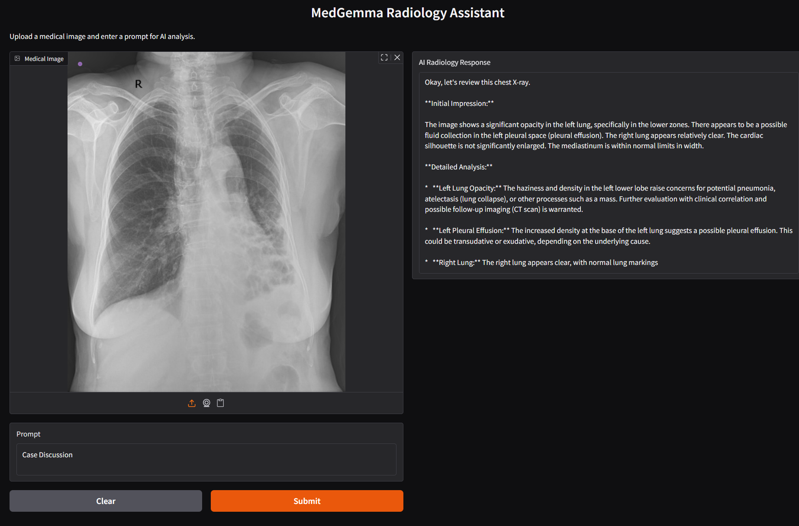

# medgemma-gradio
MedGemma Radiology Assistant with Gradio
## ⚠️ Requirements

- A CUDA-compatible GPU (recommended 16GB VRAM or more)
- [Hugging Face](https://huggingface.co/) account access to the gated model: [google/medgemma-4b-it](https://huggingface.co/google/medgemma-4b-it)

> 💡 Request access to the model [here](https://huggingface.co/google/medgemma-4b-it) before running the app.

# 🧠 MedGemma Gradio App

> A Gradio-powered AI assistant using Google's MedGemma-4B multimodal model for medical image analysis.

## 🖼️ Demo

Here’s how the MedGemma Gradio app works:

